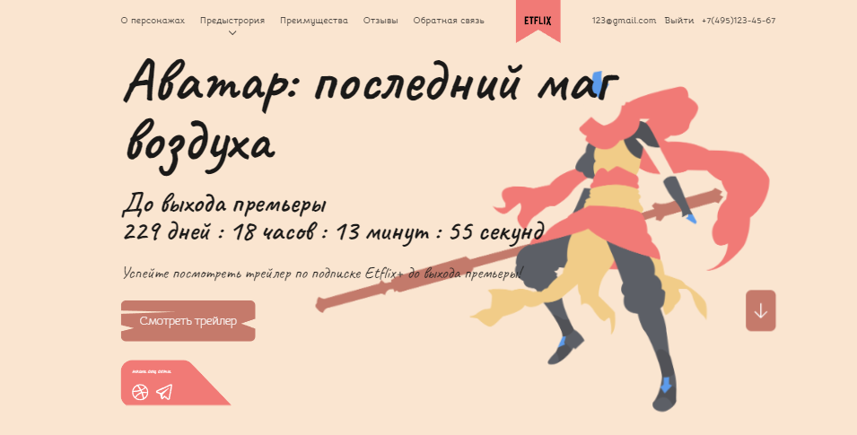
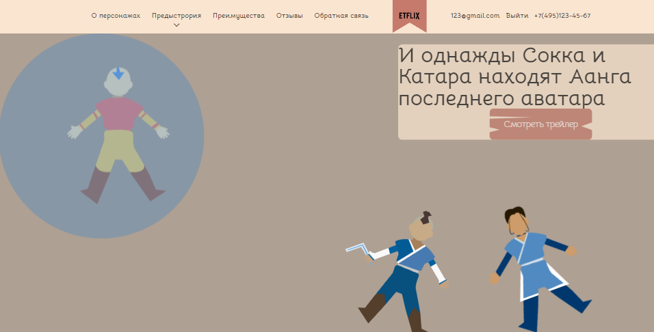
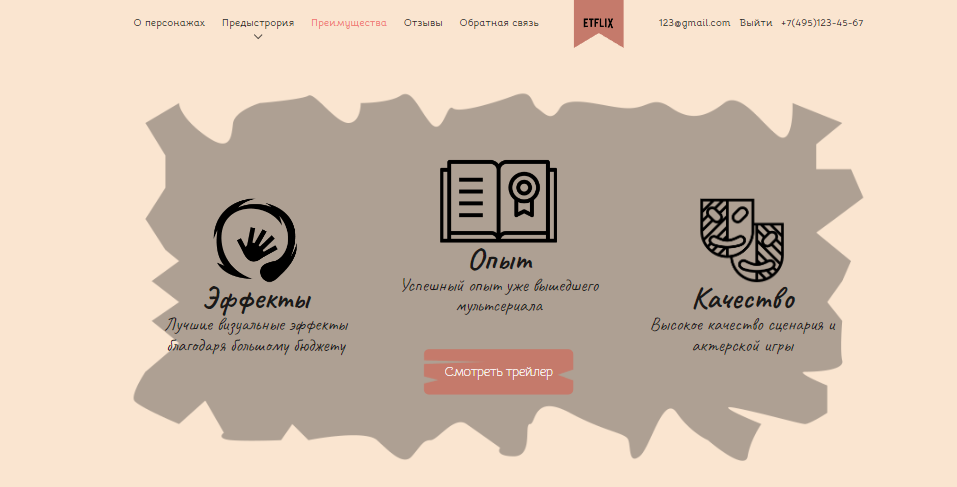

# Аватар последний маг воздуха

Добро пожаловать на лендинг "Аватар последний маг воздуха"! Это одностраничный сайт, посвященный будущему сериалу "Аватар: Последний маг воздуха". Здесь вы можете найти информацию о сериале, его персонажах и мире, а также просмотреть изображения и анимацию.

## Запуск проекта

Чтобы запустить проект локально, следуйте этим инструкциям:

1. Убедитесь, что у вас установлен Node.js на вашем компьютере.

2. Склонируйте этот репозиторий на свой локальный компьютер:
git clone https://github.com/Ggaabriel/mylanding

3. Перейдите в папку проекта:
cd mylanding

4. Установите зависимости проекта, выполнив команду:
npm install

5. Запустите локальный сервер и проект с помощью команды:
npm run dev

Это запустит сервер разработки, и вы сможете просматривать лендинг в браузере по адресу `http://localhost:3000`. А json файлы будут доступны по адресу `http://localhost:8080`

## Скриншоты

## Связь

Если у вас возникли вопросы или предложения, пожалуйста, свяжитесь со мной по электронной почте: sholakirill@icloud.com.

Спасибо, что посетили лендинг "Аватар последний маг воздуха"! Надеюсь, вам понравится!
